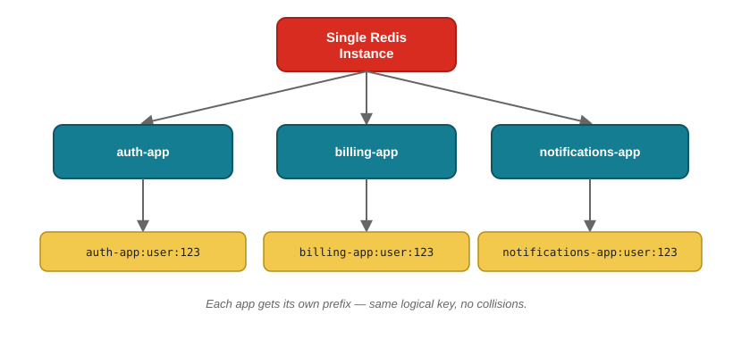
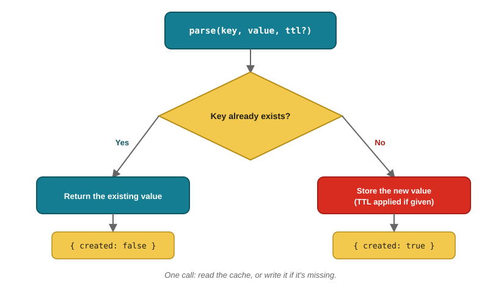

# RedisOver

[](https://www.npmjs.com/package/redisover)
[](https://www.typescriptlang.org/)
[](LICENSE)

A lightweight, type-safe Redis client for Node.js and TypeScript, built on top of [ioredis](https://github.com/luin/ioredis).

Its main job: let multiple apps safely share the same Redis instance by automatically namespacing each app's keys with a prefix. It also takes care of JSON serialization and get-or-set caching, so you write less boilerplate.

## Why RedisOver?

Redis doesn't know or care which app is writing to it — every app shares the same keyspace. If two apps happen to use the same key (like `user:123`), one silently overwrites the other's data.

RedisOver solves this by wrapping every key with an app-specific prefix. Each app ends up working in its own isolated space, even though they're all talking to the same Redis server underneath.



```typescript
const authRedis = new RedisOver({
  options: { host: 'localhost', port: 6379 },
  prefix: 'auth-app',
});

const billingRedis = new RedisOver({
  options: { host: 'localhost', port: 6379 },
  prefix: 'billing-app',
});

await authRedis.set('user:123', { role: 'admin' });
await billingRedis.set('user:123', { plan: 'pro' });

// Stored independently as:
// auth-app:user:123
// billing-app:user:123
```

Pick a stable, app-specific prefix such as `auth-app`, `billing-app`, or `notifications-app`. Since the prefix is part of the key itself, changing it later effectively creates a brand-new namespace.

## Features

- Full TypeScript types
- Automatic JSON serialization on `set`/`get`
- Key namespacing via `prefix`
- TTL support
- `parse()` — get-or-set caching in a single call
- Thin layer over `ioredis` — nothing is hidden from you

## Install

```bash
npm install redisover
```

## Quick Start

```typescript
import { RedisOver } from 'redisover';

const redis = new RedisOver({
  options: { host: 'localhost', port: 6379 },
  prefix: 'myapp', // keys are stored as "myapp:<key>"
});

await redis.set('user:123', { name: 'John Doe', age: 30 }, 60); // TTL: 60s
const user = await redis.get('user:123'); // { name: 'John Doe', age: 30 }

await redis._close();
```

Keys can also be objects — they get flattened automatically:

```typescript
await redis.set({ type: 'user', id: 123 }, { name: 'Jane Doe' });
// stored under "myapp:type_user:id_123"
```

## Smart Caching with `parse()`

`parse()` checks Redis for a value first. If it's already there, you get it back as-is. If it's missing, RedisOver stores a new one for you (with an optional TTL) and returns that instead — all in a single call.



```typescript
const result = await redis.parse('expensive-calc', JSON.stringify({ result: 42 }), 3600);

console.log(result.created ? 'value was just created' : 'value already existed', result.value);
```

## API Reference

`key` accepts a `string` or a plain `object` (flattened into `field_value` segments) in every method below.

| Method | Description |
|---|---|
| `new RedisOver(config?)` | `config.options` — [ioredis `RedisOptions`](https://github.com/luin/ioredis#connect-to-redis); `config.prefix` — key namespace; `config.logging` — enable logs |
| `set(key, value, ttl?)` | Store a JSON-serialized value. Returns `'OK'` or `null` |
| `get(key)` | Retrieve and parse a value, or `null` if missing |
| `parse(key, value, ttl?)` | Get existing value, or set and return a new one |
| `_ping()` | Health check, resolves `'PONG'` |
| `_close()` | Close the connection |

## Requirements

- Node.js >= 14
- Redis >= 5
- TypeScript >= 4 (optional, for typed usage)

## Contributing

Issues and PRs are welcome on [GitHub](https://github.com/moraeszete/redisover).

## License

[MIT](LICENSE)

---

Made by [Lucas Moraes](https://github.com/moraeszete)