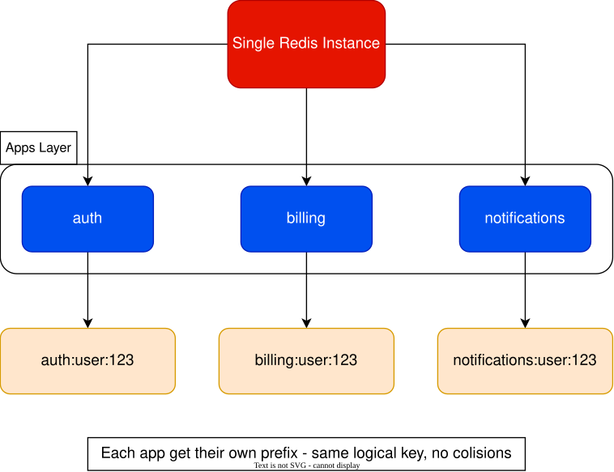
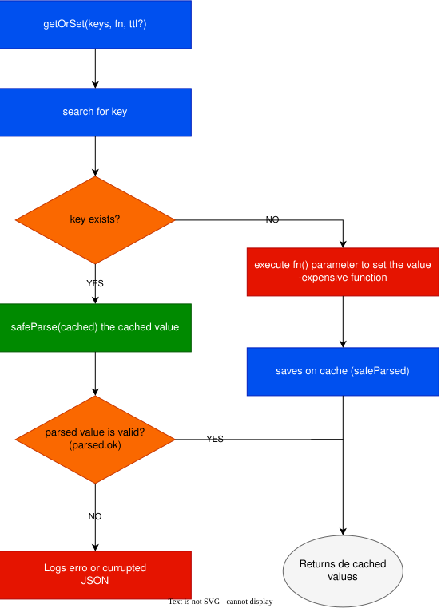

# RedisOver

[](https://www.npmjs.com/package/redisover)
[](https://www.typescriptlang.org/)
[](LICENSE)

**One Redis server for N projects** — with smart parsing (even for object keys) and smart set/get.

Simple, but powerful. Built on top of [ioredis](https://github.com/luin/ioredis).

## The idea

Redis has a single shared keyspace. If two apps use the same key (`user:123`), one overwrites the other.

RedisOver fixes that: give each project a `prefix`, and every key is automatically namespaced. All your projects can share one Redis server without ever colliding.



```typescript
const authRedis = new RedisOver({
  options: { host: 'localhost', port: 6379 },
  prefix: 'auth-app',
});

const billingRedis = new RedisOver({
  options: { host: 'localhost', port: 6379 },
  prefix: 'billing-app',
});

await authRedis.set('user:123', { role: 'admin' });
await billingRedis.set('user:123', { plan: 'pro' });

// Same Redis, zero conflicts:
// auth-app:user:123
// billing-app:user:123
```

## Install

```bash
npm install redisover
```

## Quick Start

```typescript
import { RedisOver } from 'redisover';

const redis = new RedisOver({
  options: { host: 'localhost', port: 6379 },
  prefix: 'my-app', // every key becomes "my-app:<key>"
});

// Smart set: values are serialized to JSON automatically
await redis.set('user:123', { name: 'John Doe', age: 30 }, 60); // TTL: 60s

// Smart get: values come back already parsed
const user = await redis.get('user:123'); // { name: 'John Doe', age: 30 }

await redis._close();
```

### Object keys? No problem

Keys don't have to be strings — pass an object and RedisOver flattens it for you:

```typescript
await redis.set({ type: 'user', id: 123 }, { name: 'Jane Doe' });
// stored as "my-app:type_user:id_123"

const jane = await redis.get({ type: 'user', id: 123 });
```

### Get-or-set in one call: `parse()`

`parse()` returns the cached value if it exists — or stores yours and returns it.

When storing, `parse()` uses `get()` and `set()`, in this order, under the hood — so the same smart handling applies: object keys are flattened (e.g. `{ type: 'user', id: 1 }` → `type_user:id_1`) and the value is JSON-serialized, exactly like a direct `set()` call.



```typescript
const result = await redis.parse('report', JSON.stringify({ total: 42 }), 3600);

if (result?.created) {
  console.log('cached now:', result.value);
} else {
  console.log('already cached:', result.value);
}
```

## API

Every method accepts keys as a `string` **or** a plain `object` (flattened into `field_value` segments).

| Method | What it does |
|---|---|
| `new RedisOver(config?)` | `config.options` — [ioredis options](https://github.com/luin/ioredis#connect-to-redis) · `config.prefix` — your project namespace · `config.logging` — enable logs |
| `set(key, value, ttl?)` | Stores any JSON-serializable value. Returns `'OK'` or `null` |
| `get(key)` | Returns the parsed value, or `null` if missing |
| `parse(key, value, ttl?)` | Get-or-set: returns `{ created, key, value }`. Stores via `set()`, so key flattening and value serialization apply |
| `_ping()` | Health check — resolves `'PONG'` |
| `_close()` | Closes the connection gracefully |

> Tip: hover any method in your editor — everything is documented with JSDoc, examples included.

## Requirements

- Node.js >= 14
- Redis >= 5

## Contributing

Issues and PRs are welcome on [GitHub](https://github.com/moraeszete/redisover).

## License

[MIT](LICENSE)

---

Made by [Lucas Moraes](https://github.com/moraeszete)
