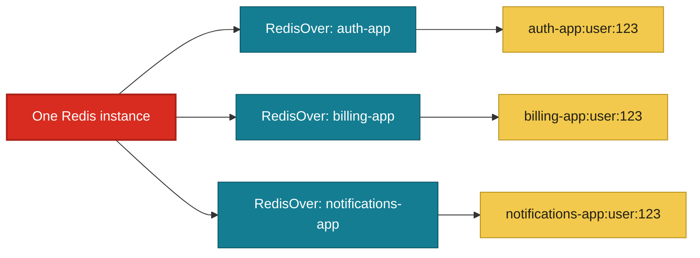

# RedisOver

[](https://www.npmjs.com/package/redisover)
[](https://www.typescriptlang.org/)
[](LICENSE)

A small, type-safe Redis client for Node.js/TypeScript, built on [ioredis](https://github.com/luin/ioredis). Its main purpose is to let multiple apps safely share the same Redis instance by automatically isolating each app's keys with a prefix. It also handles JSON serialization and cache-or-set logic, so you can skip the boilerplate.

## One Redis, Multiple Apps

RedisOver is especially useful when several applications share one Redis server or database. Create one `RedisOver` instance per app and give each instance its own `prefix`. Every key written by that instance is automatically namespaced, preventing collisions between apps while keeping the infrastructure simple.



The same logical key can therefore be used by different apps without overwriting data:

```typescript
const authRedis = new RedisOver({
  options: { host: 'localhost', port: 6379 },
  prefix: 'auth-app',
});

const billingRedis = new RedisOver({
  options: { host: 'localhost', port: 6379 },
  prefix: 'billing-app',
});

await authRedis.set('user:123', { role: 'admin' });
await billingRedis.set('user:123', { plan: 'pro' });

// Stored independently as:
// auth-app:user:123
// billing-app:user:123
```

Use a stable, app-specific prefix such as `auth-app`, `billing-app`, or `notifications-app`. The prefix is part of the Redis key, so changing it creates a new namespace.

## Features

- Full TypeScript types
- Automatic JSON `set`/`get`
- Key namespacing via `prefix`
- TTL support
- `parse()` — get-or-set caching in one call
- Thin layer over `ioredis`, nothing hidden

## Install

```bash
npm install redisover
```

## Quick Start

```typescript
import { RedisOver } from 'redisover';

const redis = new RedisOver({
  options: { host: 'localhost', port: 6379 },
  prefix: 'myapp', // keys are stored as "myapp:<key>"
});

await redis.set('user:123', { name: 'John Doe', age: 30 }, 60); // TTL: 60s
const user = await redis.get('user:123'); // { name: 'John Doe', age: 30 }

await redis._close();
```

Keys can also be objects, which get flattened automatically:

```typescript
await redis.set({ type: 'user', id: 123 }, { name: 'Jane Doe' });
// stored under "myapp:type_user:id_123"
```

## Smart Caching with `parse()`

Gets the existing value for a key, or sets it (with an optional TTL) if it doesn't exist yet — in a single call:

```typescript
const result = await redis.parse('expensive-calc', JSON.stringify({ result: 42 }), 3600);

console.log(result.created ? 'value was just created' : 'value already existed', result.value);
```

## API Reference

`key` accepts a `string` or a plain `object` (flattened into `field_value` segments) in every method above.

| Method | Description |
|---|---|
| `new RedisOver(config?)` | `config.options` — [ioredis `RedisOptions`](https://github.com/luin/ioredis#connect-to-redis); `config.prefix` — key namespace; `config.logging` — enable logs |
| `set(key, value, ttl?)` | Store a JSON-serialized value. Returns `'OK'` or `null` |
| `get(key)` | Retrieve and parse a value, or `null` if missing |
| `parse(key, value, ttl?)` | Get existing value, or set and return a new one |
| `_ping()` | Health check, resolves `'PONG'` |
| `_close()` | Close the connection |

## Requirements

- Node.js >= 14
- Redis >= 5
- TypeScript >= 4 (optional, for typed usage)

## Contributing

Issues and PRs are welcome on [GitHub](https://github.com/moraeszete/redisover).

## License

[MIT](LICENSE)

---

Made by [Lucas Moraes](https://github.com/moraeszete)